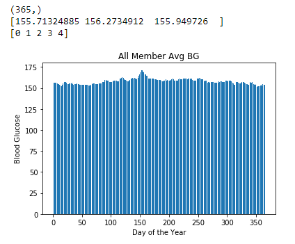
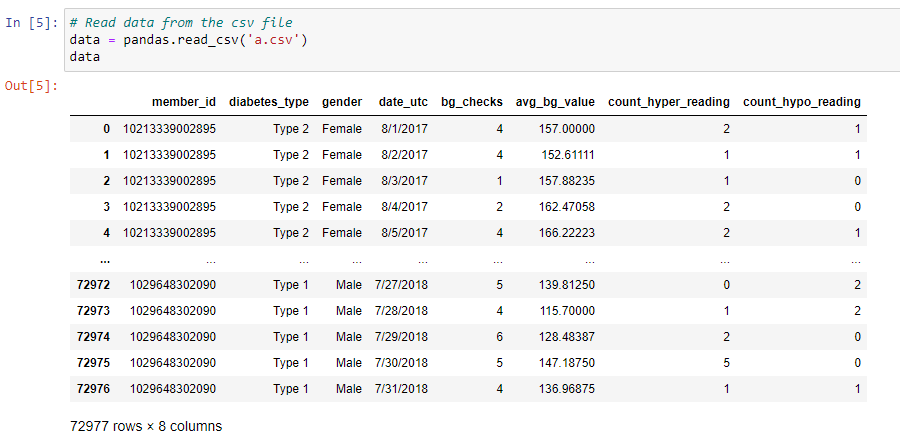

# Dataframe Operations with Pandas and Numpy

## Overview

In this example, a csv file of daily blood glucose values (365 values per unique member) is dimensionally flipped and stored in a numpy array. NaN values are replaced my the previous/next non-NaN value. Finally, the daily value averaged over all members is plotted over 365 days using matplotlib. 

Instructions modified from an assignment by Yao Li at the University of Illinois at Urbana-Champaign, yaoli90@illinois.edu.

## Files

Detailed Solution:
- Assignment_0_final.ipynb

Instructions: 
- assignment_0.docx
- bg_analysis.py

Blood glucose dataset:
- a.csv

## Notes

Please see the solution for python library dependencies. '.ipynb' file extensions are Jupyter Notebook files run from Anaconda with Python 3. Instructions for downloading Anaconda can be found by scrolling to the bottom of this [Software Carpentry site](https://swc-uiuc.github.io/2020-07-researchpark/) or on Anaconda's own website.

 

